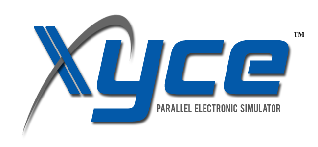

# The Xyce&trade; Parallel Electronic Simulator

## Attention!!! Open source users
Due to an internal process change, the Xyce team has decided to break/restart the project history.
The master branch has been moved to track changes rooted in a new orphaned node/commit in the repository.
The new root commit is based on the final merge commit for the 7.9 release (so that there are no differences between the top of the old tree and this new root commit).
All future updates will be pushed to the re-rooted master branch.

Users may encounter the following error trying to update their repositories:\
  `fatal: refusing to merge unrelated histories`

To resolve the issue, we recommend deleting your local master branch and creating a new branch to track origin/master.  
  `git fetch`\
  `git checkout -b temp_branch`\
  `git branch -D master`\
  `git checkout master`\
  `git branch -D temp_branch`
  
To preserve a continuous view of the project history; replace the new root commit with the head of the old history.\
  `git replace <new root tag/commit id> <origin/old_master or commit id>`

We apologize for any inconvenience.

## About the Xyce&trade; Parallel Electronic Simulator

[Xyce](https://xyce.sandia.gov)&trade; (z&#x012B;s, rhymes with "spice") is an
open-source, SPICE-compatible, high-performance analog circuit simulator. Xyce
supports the standard analysis capabilities found in other SPICE-like codes,
such as DC, transient, AC, and small-signal noise analyses; it also has less
common capabilities, such as harmonic balance, sensitivity analysis, and
uncertainty propagation techniques. Xyce supplies industry-standard compact
models and can support custom models via its Verilog-A model compiler. Foundry
process-development kits (PDKs) in other SPICE syntax can be used via the XDM
netlist translator, which is included as part of the Xyce package. In addition
to supporting use on all common desktop platforms (Mac, Windows, Linux), Xyce
can also be compiled to run in a large-scale parallel mode to provide scalable,
numerically accurate analog simulation of circuits containing millions of
devices, or more.

### Citing Xyce

If you use Xyce in your work, please cite it using the metadata
provided at the [DOE CODE
entry](https://www.osti.gov/doecode/biblio/104392) for Xyce. Citations
in various formats, including APA and BibTeX, are provided at the
bottom of that page. The DOI entry for Xyce is
[10.11578/dc.20230414.1](https://doi.org/10.11578/dc.20230414.1).

__Brief Citation__:\
Eric R. Keiter, Richard L. Schiek, Heidi K. Thornquist, Ting Mei, Jason C.
Verley, Karthik V. Aadithya, Gary J. Templet, Joshua D. Schickling, Gary L.
Hennigan. "Xyce&trade; Parallel Electronic Simulator." Computer software.
October 03, 2013. DOI: 10.11578/dc.20171025.1421.

### More About Xyce

While designed to be SPICE-compatible, Xyce is not a derivative of SPICE. Xyce
was designed from scratch to be a parallel simulation code, written in C++ and
using a message-passing implementation (MPI). Xyce also leverages Sandia's
open-source solver library, [Trilinos](https://github.com/trilinos/Trilinos),
which includes a number of circuit-specific solvers, such as the KLU direct
solver. With its modular and flexible design, Xyce applies abstract interfaces
to enable easy development of different analysis types, solvers and models.

Xyce is compatible with SPICE-based codes, in that it supports a canonical set
of SPICE compact models and standard SPICE analysis methods, such as
steady-state (`.DC`), transient (`.TRAN`), small-signal frequency domain
(`.AC`), and noise (`.NOISE`). However, Xyce goes beyond most SPICE-based codes
in a number of ways, including support for a large number of non-traditional
models, such as neuron and reaction network models. Xyce also supports Harmonic
Balance analysis (`.HB`), random sampling analysis, sensitivity calculations,
and post processing of the simulation metrics (`.FOUR` and `.MEASURE`). In
addition to analog electronic simulation, Xyce has also been used to
investigate more general network systems, such as neural networks and power
grids. In providing an Open Source version of Xyce to the external community,
Sandia hopes to contribute a robust and modern electronic simulator to users
and researchers in the field.

## Binaries Installers, Building and More

Binary installers for Windows, Mac and Red Hat Linux are made available with
every release. The installers include proprietary compact models that are not
available as open source, so they are slightly more capable than the GPLv3
variant of Xyce available on GitHub. However, they will lag the master branch,
which is always considered stable (the master branch is only pushed to when
all of the regression tests have passed.)

For the binary installers and other information about Xyce&mdash;including
[documentation](https://xyce.sandia.gov/documentation-tutorials), and [Autotools build
instruction - DEPRECATED](https://xyce.sandia.gov/documentation-tutorials/building-guide)&mdash;see
the [Xyce Homepage](https://xyce.sandia.gov) at [Sandia National
Laboratories](https://www.sandia.gov).

For CMake build instructions, see the [INSTALL.md](./INSTALL.md) file.

Xyce is also available via the [Spack](https://spack.io/) package manager.

## Support

Support for members of the Open Source Community is available at our [Google
Groups](https://groups.google.com/forum/#!forum/xyce-users) web forum, which is
actively monitored by the Xyce developers. We are also able to answer questions
in the [Discussions](https://github.com/Xyce/Xyce/discussions) section of the
repository, though the Google Group is the preferred platform. (Do not file an
issue to ask a use question.) Other ways to contact the Xyce project team can
be found on the [Xyce Homepage](https://xyce.sandia.gov/contact_us.html). See
the "[CONTRIBUTING](./CONTRIBUTING.md)" document for more information.

## Copyright and License

Copyright 2002-2025 National Technology & Engineering Solutions of Sandia, LLC
(NTESS). Under the terms of Contract DE-NA0003525 with NTESS, the U.S.
Government retains certain rights in this software.

Xyce&trade; is free software: you can redistribute it and/or modify it under
the terms of the GNU General Public License as published by the Free Software
Foundation, either version 3 of the License, or (at your option) any later
version.

Xyce&trade; is distributed in the hope that it will be useful, but WITHOUT ANY
WARRANTY; without even the implied warranty of MERCHANTABILITY or FITNESS FOR A
PARTICULAR PURPOSE.  See the GNU General Public License for more details.

A copy of the GNU General Public License is included in the
[COPYING](./COPYING) file, or see <http://www.gnu.org/licenses/>.

## Acknowledgements

Xyce has been funded by the NNSA's Advanced Simulation and Computing (ASC)
Campaign, the DARPA POSH program, and the Laboratory Directed Research and
Development program at Sandia National Laboratories. Sandia National
Laboratories is a multimission laboratory managed and operated by National
Technology & Engineering Solutions of Sandia, LLC, a wholly owned subsidiary of
Honeywell International Inc., for the U.S. Department of Energy's National
Nuclear Security Administration under contract DE-NA0003525.

SAND2019-5105 O
